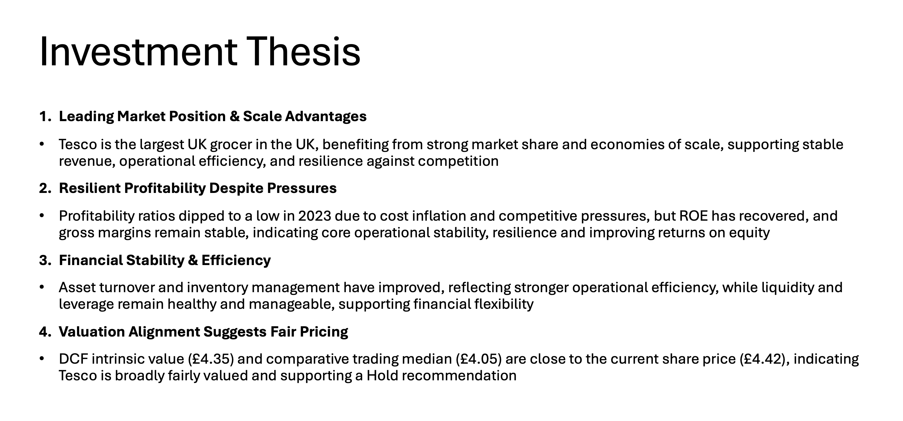
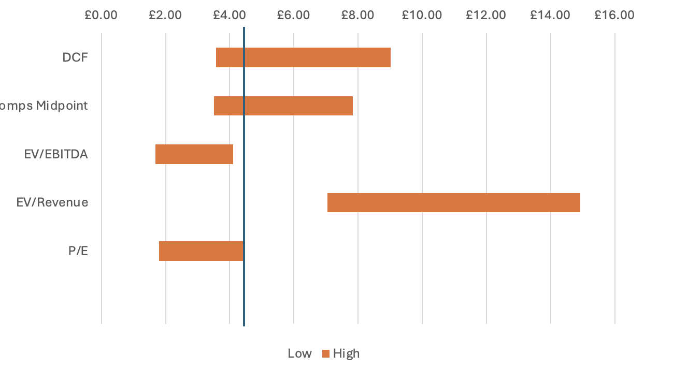
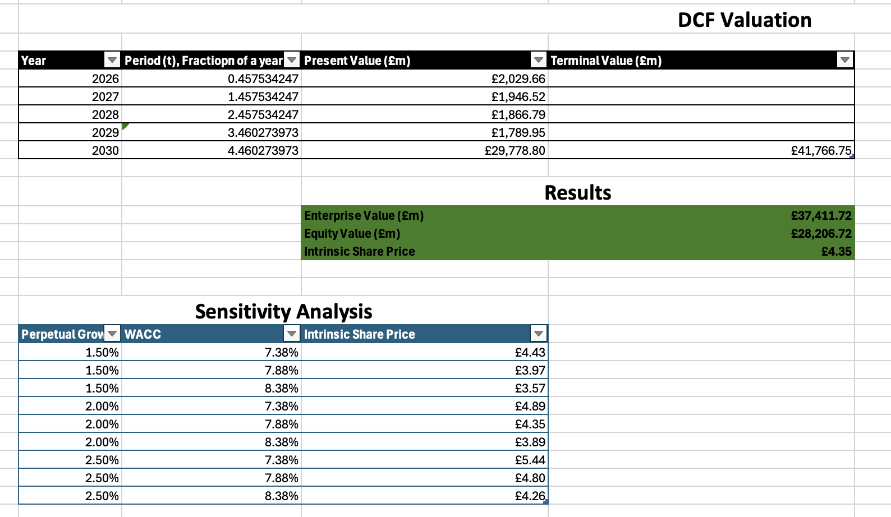
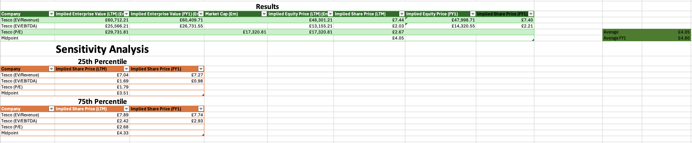
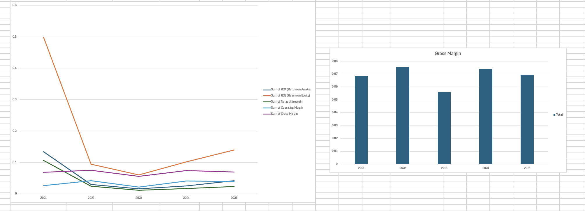
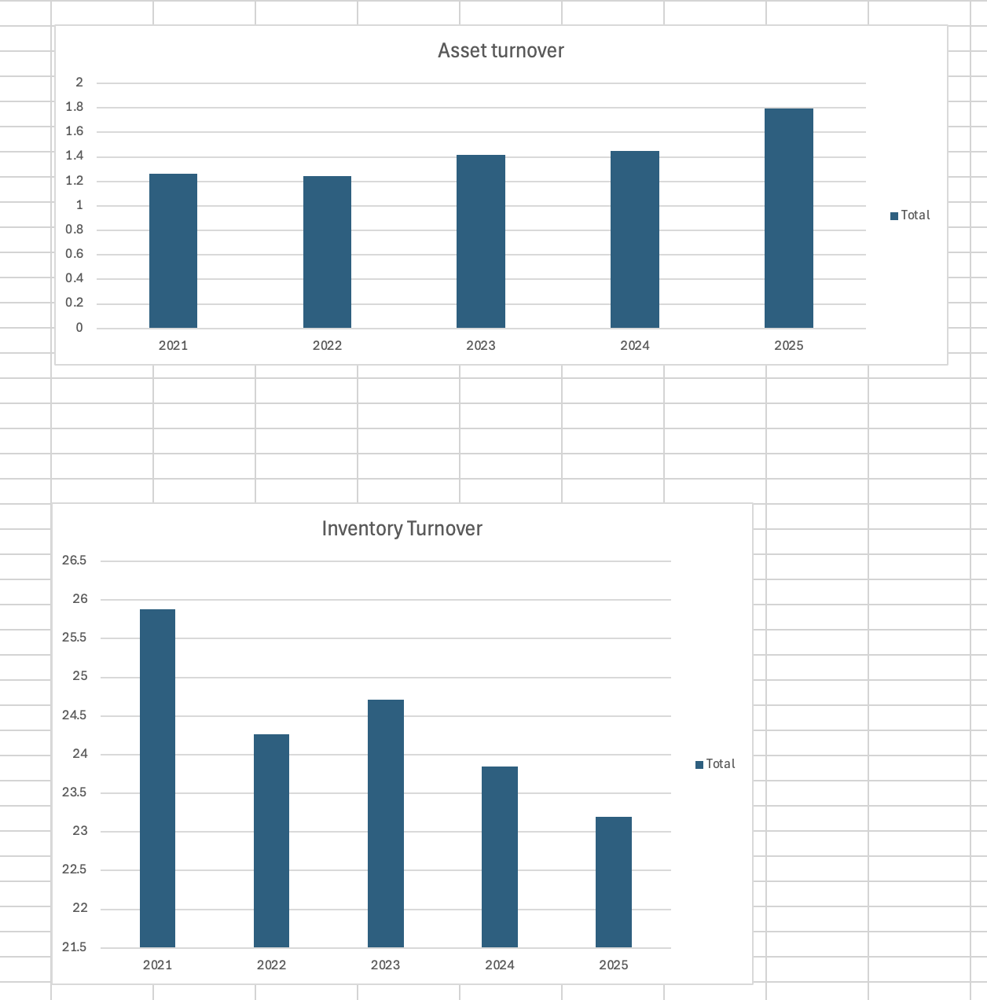
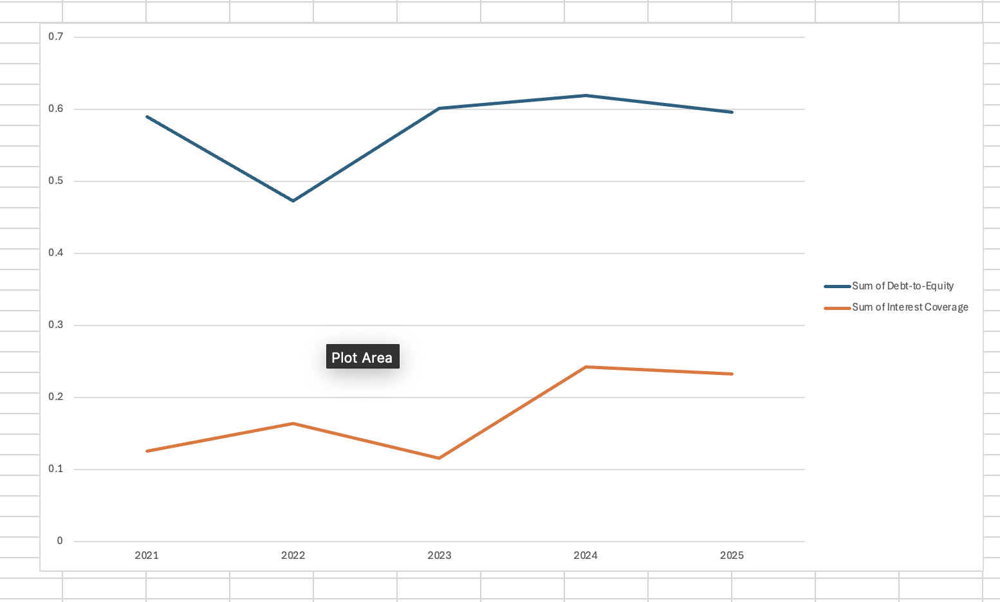
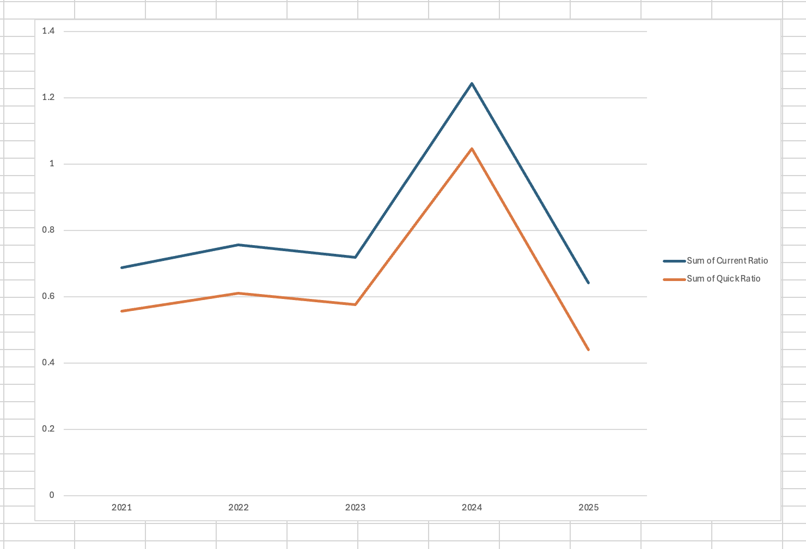

# Tesco PLC Valuation Project

Comprehensive valuation of Tesco PLC including [DCF](FinancialModels/DCF.xlsx), [peer comparables](FinancialModels/Comps.xlsx), and [ratio analysis](FinancialModels/Ratios.xlsx).  
Prepared as an investment case study to demonstrate financial modelling and [presentation and portfolio skills](ProfessionalDeliverable/Deliverable.pptx).

---

## Key Screenshots

### [Investment Thesis](ProfessionalDeliverable/Deliverable.pptx)

### [Football Field Valuation](ProfessionalDeliverable/Deliverable.pptx)

### [DCF Summary](FinancialModels/DCF.xlsx)

### [Comparable Analysis](FinancialModels/Comps.xlsx)

### Profitability & Efficiency Ratios(FinancialModels/Ratios.xlsx)
**Profitability**

**Efficiency**

### Leverage & Liquidity(FinancialModels/Ratios.xlsx)

**Efficiency**

---

## Excel & Presentation Files
All models and presentation slides are available for download:

### Excel Models
- [DCF Model](FinancialModels/DCF.xlsx) – Discounted Cash Flow valuation
- [Comps Analysis](FinancialModels/Comps.xlsx) – Comparable companies multiples
- [Ratio Analysis](FinancialModels/Ratios.xlsx) – Profitability, liquidity, leverage, efficiency

- [Slides](ProfessionalDeliverable/Deliverable.pptx)

---

## Skills Demonstrated
- Financial Modelling (Excel)  
- DCF and Comparable Company Valuation  
- Ratio Analysis & Financial Statement Interpretation  
- Data Visualization & Professional Presentation  

---

**Note:** Screenshots above provide visual summaries; full calculations and models are included in the downloadable Excel files.

